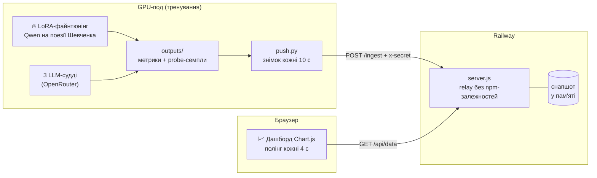

# shevchenko-dash — live-дашборд файнтюнінгу мовної моделі на поезії Шевченка

> **TL;DR (EN):** Real-time monitoring dashboard for LoRA fine-tuning of a language model (Qwen) on Taras Shevchenko's poetry. A zero-dependency Node.js relay receives JSON snapshots pushed from a GPU pod every 10 s and serves a Chart.js UI: 7 local text metrics (Tier 1), a panel of 3 independent LLM judges via OpenRouter (Tier 2), and a weighted composite score.

## Що це таке, простими словами?

Десь на орендованій GPU-машині мовна модель день і ніч вчиться писати вірші голосом Шевченка. *Технічно це LoRA-файнтюнінг: замість перевчати всю модель, до неї домальовують маленькі «поправочні» шари і тренують лише їх — на порядки дешевше й швидше.* А це репо — кардіомонітор біля її ліжка.

Пульс на моніторі — крива *eval loss*: наскільки модель помиляється на віршах, яких не бачила під час навчання. Тиск — локальні аналізи самого тексту: чи не зациклилась вона на одному рядку, чи вживає старий правопис із «ѣ» та «ъ», чи тримає силабічний ритм. А на обхід приходять три незалежні лікарі — три різні LLM-моделі через *OpenRouter* (агрегатор доступу до багатьох моделей) — читають свіжі вірші й ставлять оцінки за стиль, ритм, лексику і граматику. Коли діагнози розходяться, монітор так і пише: «судді не узгоджені».

Кожні 10 секунд GPU-машина шле сюди знімок стану, і будь-який браузер бачить його з затримкою в кілька секунд — без SSH і без жодного доступу до самого пода.



## Можливості

- **Live-цикл**: под пушить знімок кожні 10 с, браузер опитує `/api/data` кожні 4 с; якщо даним понад 40 с — статус stale, зелений «пульс» стає червоною крапкою.
- **Tier 1 — 7 локальних метрик, $0 за обчислення**: `distinct_1` / `distinct_2` (різноманітність лексики й неповторюваність), `ngram_novelty` (не переписує тренувальний корпус), `old_orthography_rate` (щільність правопису XIX ст.: ѣ, ъ), `lexicon_density` (шевченківська лексика), `avg_syllables_per_line` (силабіка, орієнтир 6–18 складів), `train_eval_gap` (індикатор overfitting).
- **Tier 2 — панель LLM-суддів**: 3 незалежні моделі через OpenRouter, кожна ставить 4 оцінки 1–10 (стиль, ритм, лексика, граматика); дашборд показує консенсус і дисперсію (< 1 — «узгоджені», > 3 — «великий» розкид).
- **Композитний бал** за формулою: `loss · 25% + novelty · 20% + diversity · 15% + style · 15% + LLM-judge · 25%`.
- **Графік на три осі Y**: eval loss, quality score (0–100) і composite (0–1) на одній часовій шкалі.
- **Таблиця експериментів** з підсвіткою рекордів: золото — найкращий eval loss, фіолетовий — найкращий composite; колонки від rank і VRAM до тривалості й опису рана.
- **Probe-семпли**: свіжозгенеровані вірші прямо в дашборді, з quality score (стара орфографія, штраф за повтор рядків, латинські символи як маркер «протікання» іншої мови).
- **Лічильник грошей**: сумарний GPU-час і оцінка вартості (ставка `GPU_HOURLY`, за замовчуванням $3/год).

## Чому це цікаво технічно

- **Нуль залежностей з обох боків дроту.** `server.js` — чистий Node.js (у `package.json` немає секції `dependencies`), `push.py` — тільки стандартна бібліотека Python (`urllib`, `subprocess`, `json`, `re`). Пушер можна закинути на будь-який под без `pip install`, relay розгортається однією командою `npm start`.
- **Push, а не pull.** Сервер не ходить до GPU-пода — под сам штовхає знімки назовні. Под може жити за NAT/фаєрволом, а його смерть не кладе дашборд: той просто чесно показує stale.
- **Один снапшот у пам'яті замість бази даних.** Дашборду потрібен лише останній стан, історію метрик веде сам под у своїх JSON-ах — тому на сервері немає ні БД, ні черги. Компроміс: рестарт сервера обнуляє екран до наступного пуша (≤ 10 с). Плюс ліміт тіла запиту 5 МБ проти переповнення пам'яті.
- **Недовіра до власного пода.** Усі рядки з пода (коміт-меседжі, згенеровані вірші) проходять екранування + DOMPurify перед вставкою в DOM — вірш, у якому модель раптом згенерує HTML, не стане XSS. Інжест закритий заголовком `x-secret`.
- **Пасивний моніторинг.** `push.py` не чіпає тренування: читає готові JSON-и з `outputs/` і через `pgrep` перевіряє, чи жива тренувальна джоба. Крах пушера не може зіпсувати ран.

## Як запустити

Потрібен Node.js >= 18.

### Relay + дашборд локально

```bash
git clone https://github.com/SerhiiDubei/shevchenko-dash
cd shevchenko-dash
INGEST_SECRET=my-secret npm start
```

Дашборд відкриється на `http://localhost:3000`.

| Змінна | За замовчуванням | Навіщо |
|---|---|---|
| `PORT` | `3000` | порт HTTP-сервера |
| `INGEST_SECRET` | `dev-secret` | токен, який пушер передає в заголовку `x-secret` |

Ендпоінти: `POST /ingest` (приймає JSON до 5 МБ), `GET /api/data` (снапшот + вік даних + прапорець stale), `GET /healthz`, `GET /` (UI).

Перевірити інжест без пода можна вручну — сервер збереже будь-який валідний JSON:

```bash
curl -X POST http://localhost:3000/ingest \
  -H "content-type: application/json" \
  -H "x-secret: my-secret" \
  -d '{"experiments": [], "samples": []}'
```

### Пушер на GPU-поді

```bash
DASH_URL=https://<your-app>.up.railway.app/ingest \
DASH_SECRET=my-secret \
python3 push.py
```

| Змінна | За замовчуванням | Навіщо |
|---|---|---|
| `DASH_URL` | — | URL ендпоінта `/ingest` |
| `DASH_SECRET` | — | має збігатися з `INGEST_SECRET` сервера |
| `GPU_HOURLY` | `3.0` | ставка $/год для оцінки вартості |

### Деплой на Railway

Достатньо підключити репо: команда старту — `npm start`, порт Railway передає через `PORT`. Єдине, що треба задати руками, — змінну `INGEST_SECRET`.

## Стан проекту

**Працює:** повний цикл под → relay → браузер; використовувався для живого моніторингу реальних LoRA-ранів (Tier 1 + Tier 2 + композит, графіки, таблиця, семпли).

**Чесні обмеження:**

- Історія не зберігається на сервері — лише останній снапшот у пам'яті. Після рестарту дашборд порожній до наступного пуша.
- `x-secret` — захист від випадкових пушів, а не від цілеспрямованого атакуючого; транспорт закриває HTTPS Railway. Дефолтний `dev-secret` для продакшену треба замінити.
- Chart.js і DOMPurify підтягуються з CDN — без інтернету графіки не намалюються.
- Тестів і CI немає.
- Сам тренувальний пайплайн і код LLM-суддів живуть в окремому репозиторії (`shevchenko-ft`) на GPU-поді — тут лише моніторинг. Шлях `/workspace/shevchenko-ft/outputs/` у `push.py` захардкоджено під конкретний под.
